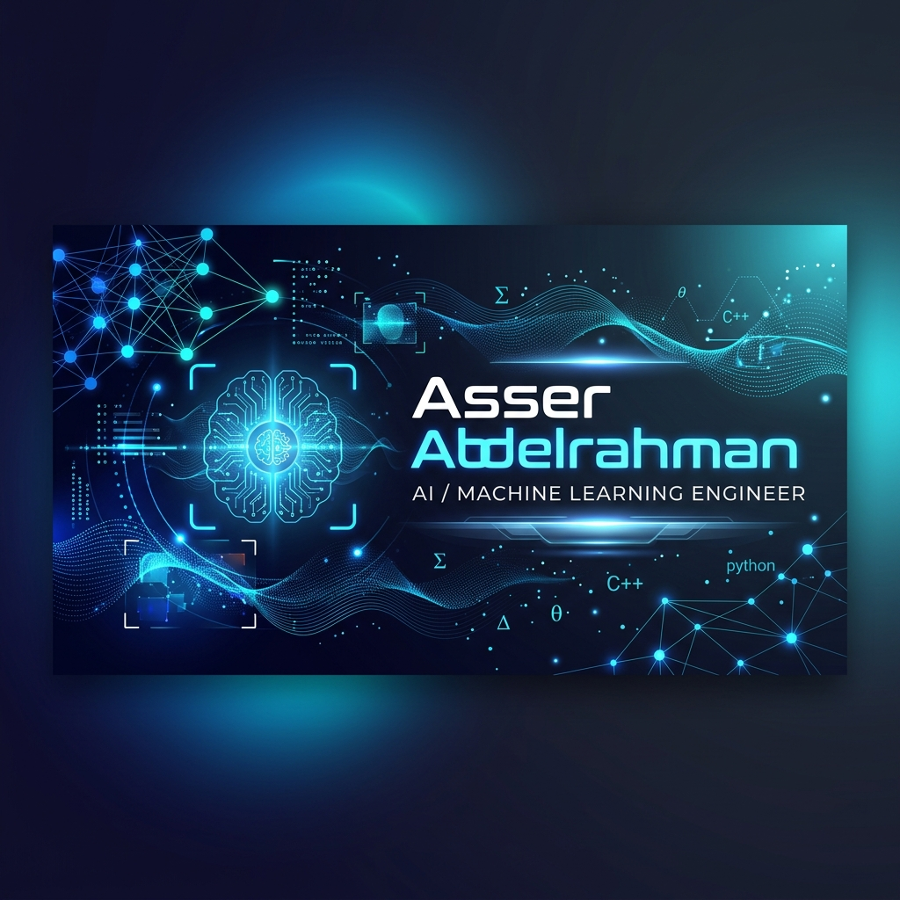

  

<h1 align="center">Hi there, I'm Asser Abdelrahman! 👋</h1>

  <strong>AI / Machine Learning & Computer Vision Engineer</strong>

  
  
  

---

### 🚀 About Me

I am a **Computer Engineering graduate** specializing in **Artificial Intelligence and Computer Vision**, with hands-on experience building and deploying real-world AI systems. My expertise covers machine learning pipelines, model integration, APIs, and intelligent automation solutions. I love developing scalable intelligent systems and impactful assistive technologies.

- 📍 Based in **Giza, Egypt**
- 🎓 Computer Engineering Graduate (ACU, GPA: 3.42)
- ⚡ Fun fact: Passionate about combining AI with hardware, like deploying real-time models on Raspberry Pi!

---

### 🛠️ Tech Stack & Skills

  <!-- Languages -->
  
  
  
  
  
   
  <!-- Frameworks & Libraries -->
  
  
  
  
  
  
   
  <!-- Concepts -->
  
  
  
  
  
  
   
  <!-- Tools -->
  
  
  
  

---

### 💼 Work Experience

- **Machine Learning Developer Trainee** @ *Digilians – Digital Pioneers Initiative (MCIT & Egyptian Military Academy)* 
  `Feb 2026 - Present`
  - Selected for a top-tier national AI diploma (~3,000 accepted out of ~40,000 applicants).
  - Building end-to-end ML/DL/NLP/CV pipelines and implementing Generative AI (LLMs, GANs, Hugging Face).
  - Applying MLOps practices and deploying production-level AI models on Azure AI.

- **AI Engineer Intern** @ *IST Networks* 
  `Jul 2025 - Aug 2025`
  - Gained enterprise experience with software workflows, RAG, APIs, and LangChain.
  - Developed and deployed an HR chatbot using Kore.ai, optimizing conversational flows and NLP training.

---

### 🌟 Featured Projects

#### 🕶️ **AI Smart Glasses for the Visually Impaired** (Graduation Project: A+)
*Python | Raspberry Pi | OpenCV | YOLOv8 | Label Studio | Ultralytics | TTS/STT*
- Designed and built a real-time assistive AI system to enable environmental awareness for visually impaired users.
- Features include object detection, OCR (text recognition), currency recognition, and voice-guided NLU interface.
- Achieved **15 FPS real-time performance** optimized specifically for Raspberry Pi hardware.

#### 🎥 **Quran Video Generator**
*TypeScript | HTML5 Canvas | Audio Sync | Node.js*
- A cinematic Quran recitation player and video generator with high-fidelity canvas typography.
- Integrates EveryAyah audio sync and enables browser-based MP4 exporting.
- Check out the repository: [`quran-video-generator`](https://github.com/hotohory13/quran-video-generator)

#### 🎬 **FlixyMagnet – Watchlist Tracker App**
*Python | Tkinter | TMDb API | OOP*
- Built a lightweight TV show and movie tracker application following OOP design principles.
- Check out the repository: [`FlixyMagnet`](https://github.com/hotohory13/FlixyMagnet)

---

### 🎓 Education & Certifications

- **B.Sc. in Computer Engineering** | Ahram Canadian University (GPA: 3.42) `2022 - 2025`
- **Data Science & AI Diploma** | AMIT Learning
- **Huawei Certifications**: HCCDA-AI, HCCDA-Tech Essentials, HCCDA-Big Data
- **Data Science and Analysis using Power BI** | MCIT
- **Introduction to Artificial Intelligence** | Zewail City of Science and Technology

---

### 📊 GitHub Stats

  
  

---

  🌐 <em>Let's connect! Always open to collaborating on AI/ML and Computer Vision projects.</em>

